# SKN13-3rd-3Team

## 1. Introduce Team
### 1.1 프로젝트명: AI 인플루언서, 필라테스 강사 SERA(Smart Exercise & Rehabilitation AI)
 – 재활&운동 전문가 AI SERA
  
#### 인플루언서후원자들
<table align=center>
  <tbody>
   <tr>
      <td align=center><b>구재회</b></td>
      <td align=center><b>모지호</b></td>
      <td align=center><b>박현아</b></td>
      <td align=center><b>이재범</b></td>
      <td align=center><b>장진슬</b></td>
    </tr>
    <tr>
      <td align="center">
        
      </td>
      <td align="center">
        
      </td>
      <td align="center">
        
      </td>
      <td align="center">
        
      </td>
      <td align="center">
        
      </td>
    </tr>
    <tr>
        <td align="center">
       
       </td>  
       <td align="center">
       
        <td align="center">
       
       </td>
       <td align="center">
       
       </td>
       <td align="center">
       
       </td>
    </tr>
  </tbody>
</table>
 
  

### 1.2 R&R

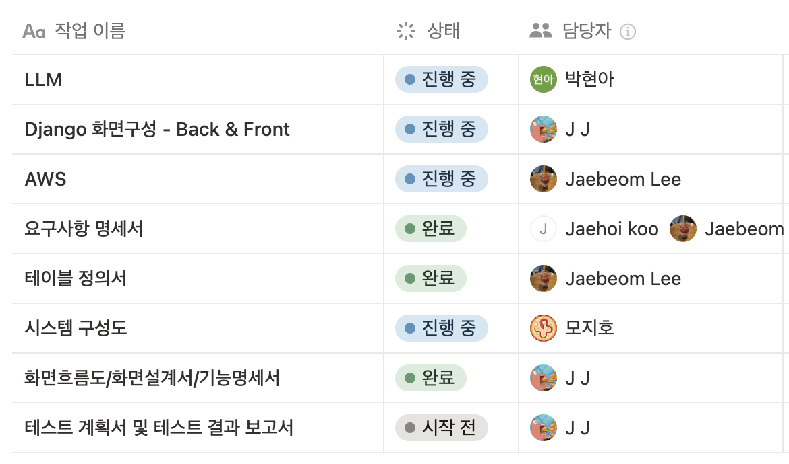

--------------------------------------------
# 2. Project Overview 
## 2.1 프로젝트 소개

**팀원들의 고민 : AI Influencer 와 AI Assistant의 비교** 

1. 인플루언서 
인플루언서는 "영향력을 행사하는 사람"이다. 
단순히 정보만 제공하는 것이 아닌 콘텐츠 제작+감성연결+신뢰유도가 핵심이라고 생각한다.  
LLM 기반 AI 인플루언서는 사람들에게 개성을 팔고, 제품 소구를 하면서 팬 기반 인기를 끄는 사람이라고 생각한다. 
페르소나를 정해서 하나의 인격체를 만드는 것을 목표로 하면 좋을 것 같다. 

2. 어시스턴트 
어시스턴트는 정보 제공을 하고, 1:1 대화를 하고, 질문 응답, 정보 요약, 명령 수행 등을 한다고 생각한다. 이는 1회성 도움으로 정보를 받고 끝내는 용도라고 생각한다. 
어시스턴트로 가게된다면 정보검색, 문서요약, 응답생성에서만 그치는 도구가 될 것 같다. 
챗봇, 고객센터 여기에 얼굴만 넣는다? 단순히 LLM에 얼굴만 붙이고 “말투”만 꾸미는 건,
결국 ‘정보형 챗봇에 스킨만 입힌 것’에 불과하다. 
도움 역할은 하겠지만, 우리의 큰 주제는 ‘인플루언서’를 만드는 것입니다.  

  
그래서 우리가 만든 인플루언서는  

🧐 **"기억하고, 반응하고, 시간을 느끼는 - 사람같은 AI 인플루언서의 탄생"**  

💬 왜 사람처럼 느껴지는 AI인가?
우리는 AI가 사람처럼 느껴지기 위해서는 다음의 세 가지 요소가 필수적이라고 보았습니다:

1. 일관된 성격: 시간과 상황이 달라져도 변하지 않는 말투와 태도, 특정 인격처럼 느껴지는 일관된 커뮤니케이션 스타일

2. 개별 사용자에 대한 기억: 사용자마다 이전 대화 내용을 기억하고, 개인 취향이나 과거 이력에 맞춘 맞춤형 응답을 지속하는 능력
   
3. 사용자와의 마지막 상호작용: 마지막 대화 이후 얼마나 시간이 흘렀는지를 인지하고, “오랜만이에요”, “다시 찾아주셨네요” 같은
자연스럽고 상황에 맞는 반응을 제공하는 능력

나아가, 챗봇이 ‘자신의 목표’를 표현하고 행동하는 의지까지 지니게 한다면, 이는 단순한 도구를 넘어 진짜 인플루언서로 작동할 수 있다고 판단했습니다. 

 

🧠 **LLM 기반 RAG 구조로 재활운동 제안,통증부위 상담 챗봇 을 구현.**  

> 회원가입 된 사용자의 아이디를 세션으로 기억하여 개인화된 상담 제공  
✔️ **기억하는 AI**의 재활운동 제안, 통증부위 상담을 통해 **AI와 사용자의 유대감 형성, 지속적인 관계 형성**을 목표  

  

## 2.2 프로젝트 목표

1. 재활 논문, 필라테스 블로그 기반 RAG 챗봇
  - 논문, 필라테스 블로그의 게시물을 크롤링
  - 전문성을 위한 데이터 구축
  - 사용자 정보와 연동되어 개인화된 응답을 제공

2. Django 기반 AI Influencer 스타일의 홈페이지 구현, 회원 관리
  - 핑크 톤의 홈페이지 구축을 통해 활기찬 운동 전문 AI 인플루언서를 표현
  - 관리자 페이지에서 회원 정보, 피드, 투표 항목을 생성/수정/삭제 가능

3. AWS
  - EC2 인스턴스, Gunicorn 활용 웹 서버 환경 구축 및 웹 배포

 

### 2.2.3 🛠️ 사용한 기술 스택
  

  
  
  
  

  
  
  
  

  

--------------------------------------------
## 3. System Architecture
 

  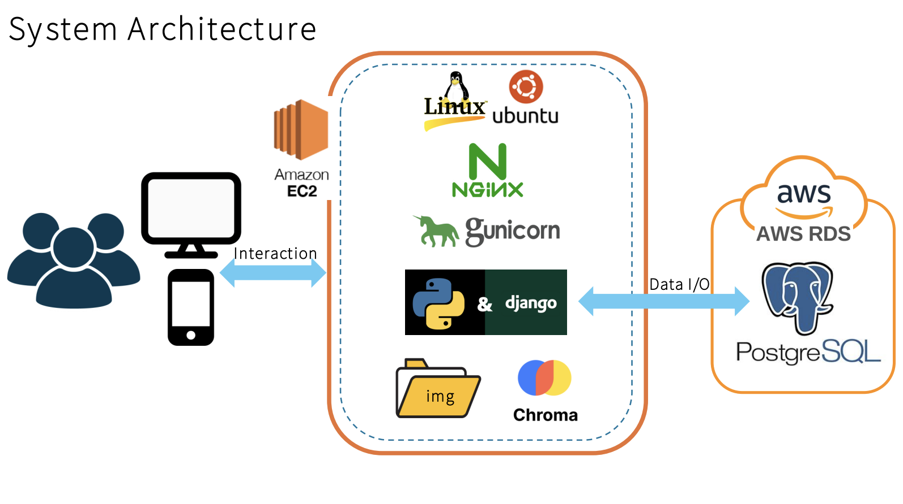

 

--------------------------------------------
## 4. 구현 화면 
### screen flow
 
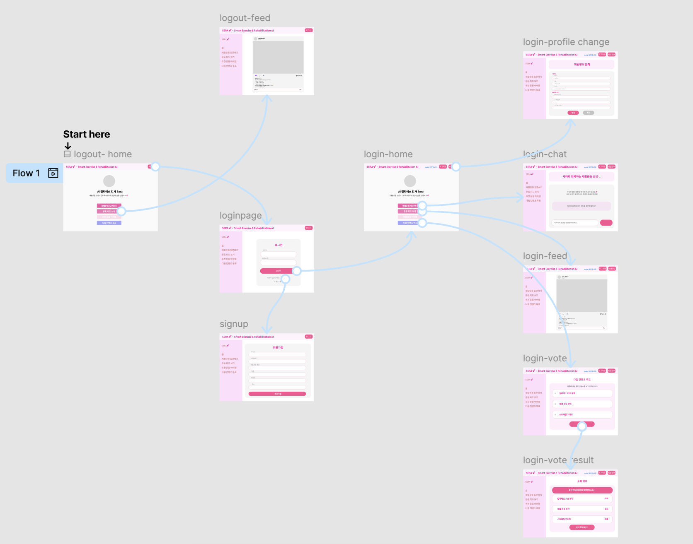
 

### 4.1 Home - 홈
 
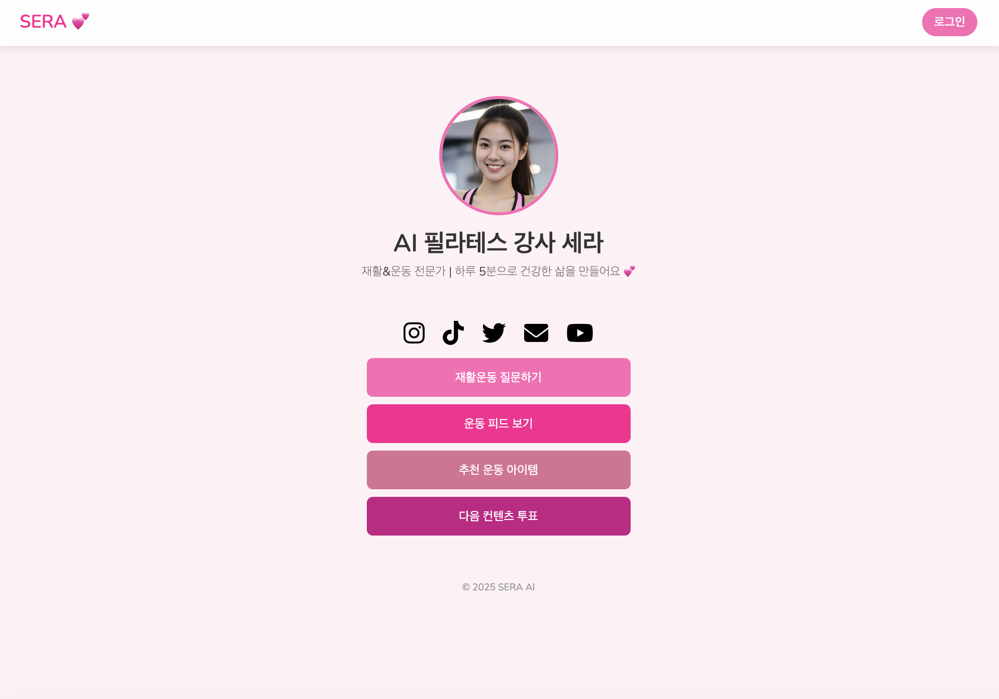
 
- 로그인 버튼 : 로그인 창으로 이동한다. 
- 재활운동 질문하기 버튼 : AI 챗봇 화면으로 이동한다. 로그인한 사람만 이용할 수 있다.("로그인을 하세요") 
- 운동피드 보기 버튼 : 인스타그램 형식의 SNS 게시물 화면으로 이동한다. 로그인을 안해도 피드 창으로 이동 가능하다.  
- 추천 운동 아이템 버튼 : '준비중 입니다.' 창이 뜬다. 
- 다음 컨텐츠 투표 버튼 : 회원들에게 다음 컨텐츠를 투표하게 하는 화면으로 이동한다. 로그인 한 사람만 이용할 수 있다.("로그인을 하세요") 

### 4.2 Login - 로그인
 
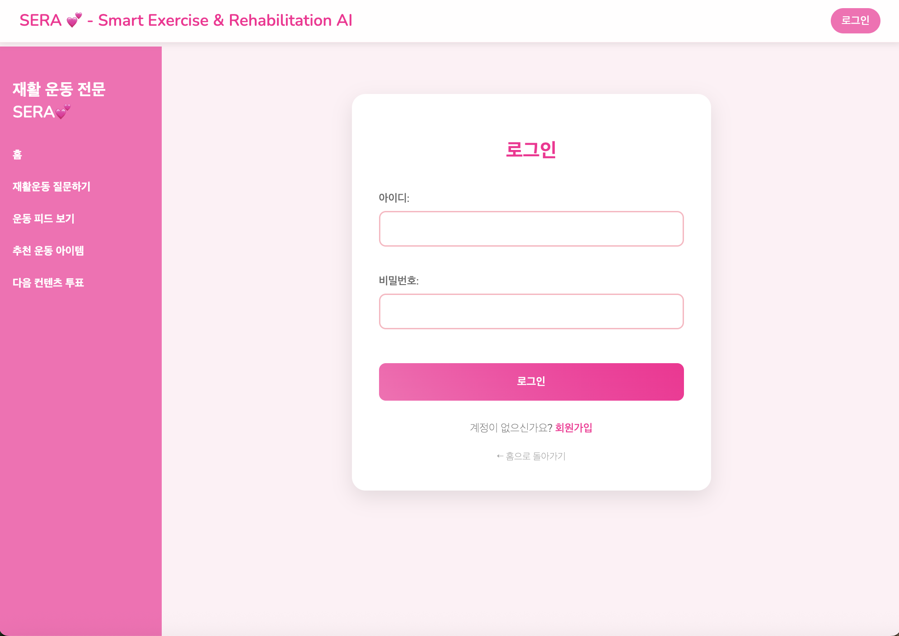
 
- 아이디 입력란 : 회원가입을 완료한 아이디를 입력한다.  
- 비밀번호 입력란 : 회원가입을 완료한 아이디의 비밀번호를 입력한다. 
- 로그인 버튼 : 아이디와 비밀번호를 입력하고 버튼을 누르면 로그인이 된다. 
- 회원가입 버튼 : 회원가입 창으로 이동한다.  
- 홈으로 돌아가기 버튼 : 홈으로 돌아간다.  

### 4.3 Sign up - 회원가입
 
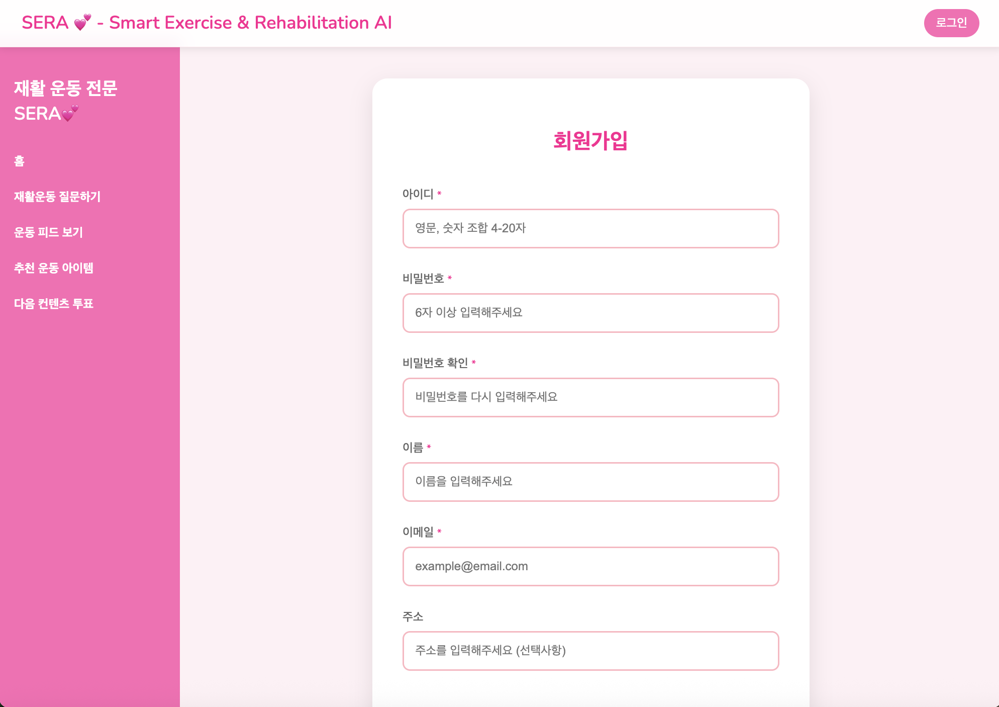
   
- 아이디 입력란 : 회원가입을 할 아이디를 입력한다. ("영문, 숫자 조합 4-20자") 
- 비밀번호 입력란 : 회원가입을 할 아이디의 비밀번호를 입력한다. ("6자 이상 입력해주세요.") 
- 비밀번호 확인 검사란 : 비밀번호를 재입력해 위의 비밀번호와 같은지 검사한다.  
- 이름 입력란 : 이름을 입력한다.  
- 이메일 입력란 : 이메일을 입력한다. (이메일 주소에 '@'를 포함해야한다.) 
- 주소 입력란 : 선택사항이라 입력하지 않아도 회원가입이 된다. 
- 회원가입 버튼 : 모든 입력란이 오류가 없다면 회원가입을 완료한다.  

### 4.4 💬 Chat - 채팅 시스템
 
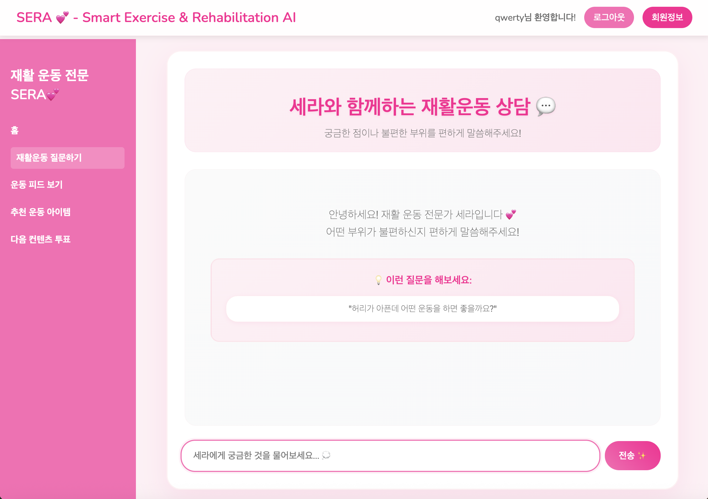
 
- 챗봇 질문 입력 칸 : 궁금한 점을 입력 칸에 입력한다. 
- 챗봇 질문 입력 버튼 : 질문을 입력하고 버튼을 누른다. 엔터로도 활성화 된다. 

### 4.5 📱Feed - SNS 구현
 
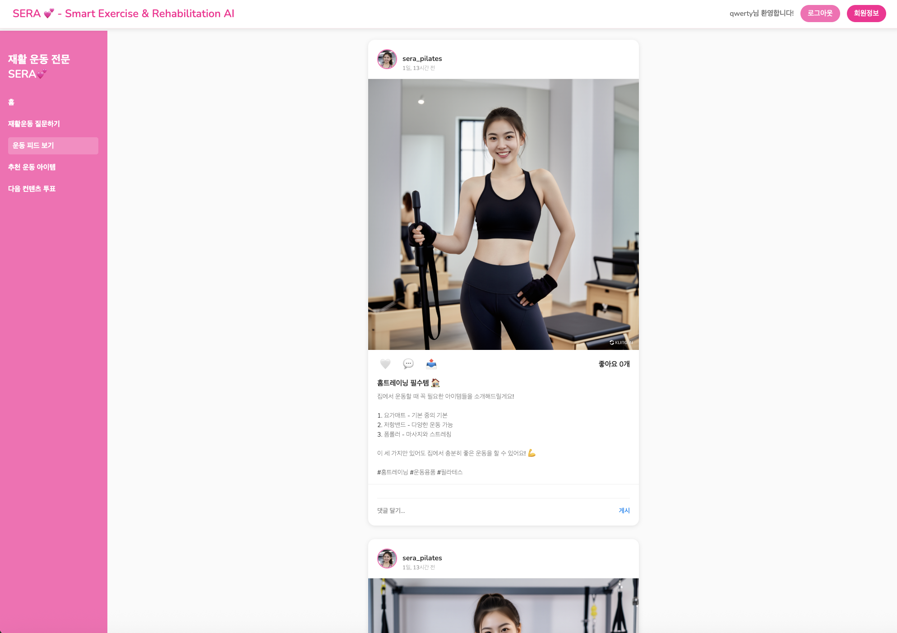
 
- 좋아요 버튼 : 하트를 누르면 빨간 하트로 변한다. 우측의 좋아요가 +1 된다. 
- 댓글 : 댓글을 달면 화면에 등록된다, 작성자만이 삭제가 가능하다.  

### 4.6 📊 Vote / Vote result - 투표 시스템
 
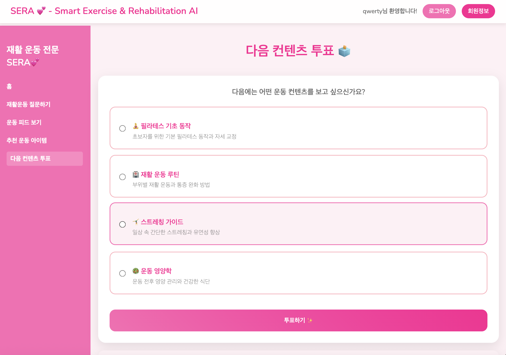
 
- 투표 선택지 버튼 : 투표 선택지 중 하나를 클릭하면 왼쪽 동그라미 색깔이 변한다.  
- 투표하기 버튼 : 선지를 선택하고 투표하기 버튼을 누른다. 이미 선택한 선지는 선택할 수 없다.  
 
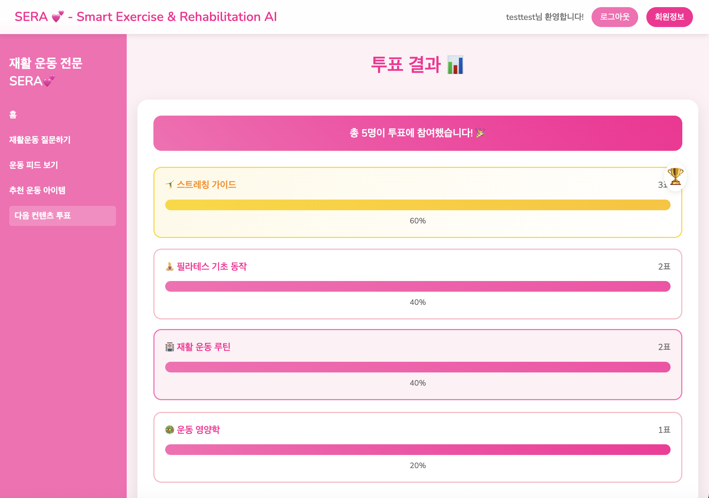
 
- 투표 결과 창  

### 4.7 Profile change - 회원정보 변경 
 
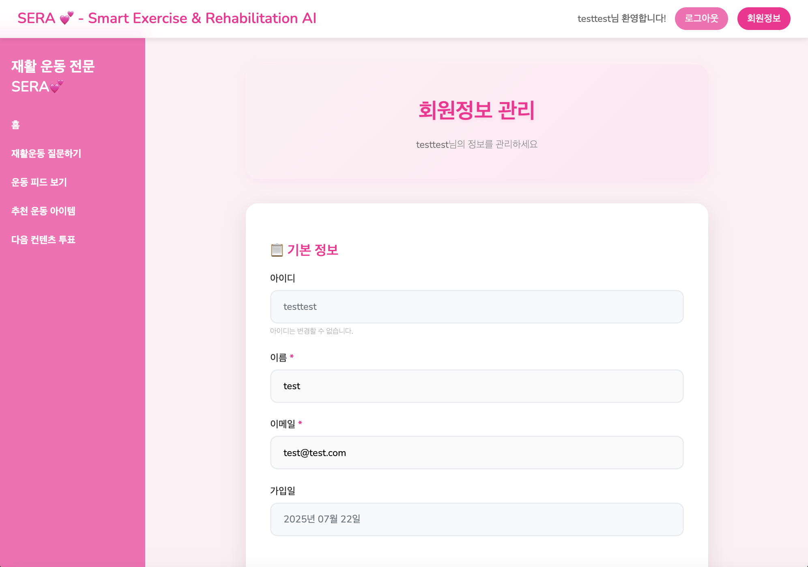
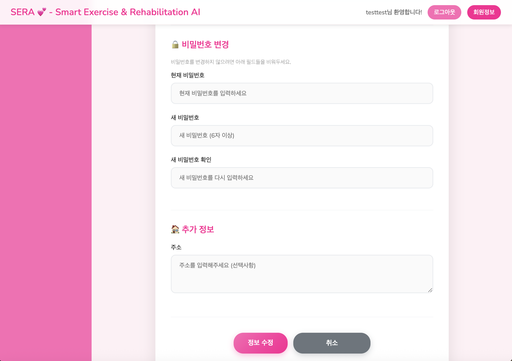
 
- 기본정보-아이디 : 가입한 아이디를 확인할 수 있다.  
- 기본정보-이름 : 가입 시 입력한 이름을 확인할 수 있다.  
- 기본적보-이메일 : 가입 시 입력한 이메일을 확인할 수 있다.  
- 비밀번호 변경-현재 비밀번호 입력란 : 현재 비밀번호를 입력하는 칸이다.  
- 비밀번호 변경-새 비밀번호 입력란 : 새로운 비밀번호를 입력하는 칸이다. 
- 비밀번호 변경-새 비밀번호 확인 검사란 : 비밀번호를 재입력해 위의 비밀번호와 같은지 검사한다.  
- 회원정보 변경 버튼 : 회원정보 입력후 변경 버튼을 누르면 회원정보가 변경된다. 
- 회원정보 변경 취소 버튼 : 회원정보 변경을 취소한다.  

  

--------------------------------------------
## 5. DB 구축

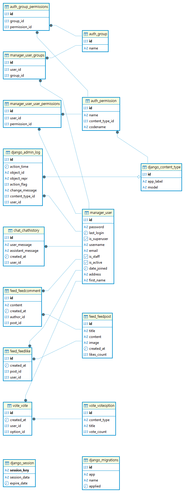

💽 DB 선택: Chroma 
- 논문과 전문가 기고문을 각각 파싱 
- 문서를 일정한 청크로 분할 
- OpenAI의 text-embedding-3-large 모델을 통해 임베딩 
- Chroma를 통해 데이터 벡터화 
- 논문 Chroma DB와 전문가 기고문 Chroma DB, 2개의 Chroma DB를 하나의 Chroma DB로 병합 

  

--------------------------------------------
## 6. AWS 배포
EC2, Gunicorn
  

--------------------------------------------
## 7. 최종프로젝트에 구현할 것
AI가 먼저 말을 걸고, 사용자의 과거 대화를 기억하며, 
**“오랜만이에요, 지난번 통증은 좀 나아지셨어요?”**와 같은 시간기반/기억기반 반응을 실현할 예정입니다. 
또한 **“더 나은 트레이너가 되고 싶다”**, “앞으로 이런 피드백을 더 잘 반영하고 싶다”는 식의 **의지 표현**을 통해, 
AI가 **목표를 가진 존재처럼 반응하는 인간형 인플루언서**의 모습을 구현하고자 합니다. 
 
 
여기에 더해, 사용자의 운동 목적이나 증상에 맞춰 
**운동 방법과 재활 동작을 이미지, 영상, 음성으로 안내하고**, 
스트레칭 도구, 자세 보조 용품, 생활 습관 팁 등도 함께 제안함으로써 
**실질적인 운동 조력자 역할까지 수행하는 멀티모달 AI 인플루언서**를 목표로 합니다. 

  

--------------------------------------------
## 8. 한 줄 회고 💭

| 이름 | 한 줄 회고 |
|:------:|-------------------|
| 재회 | EC2야 아프지마|
| 지호 | 써|
| 현아 | 주|
| 재범 | 세요|
| 진슬 | 넘 재밌다.. 최종 기대돼요🤩|

  
  
  

끝.

